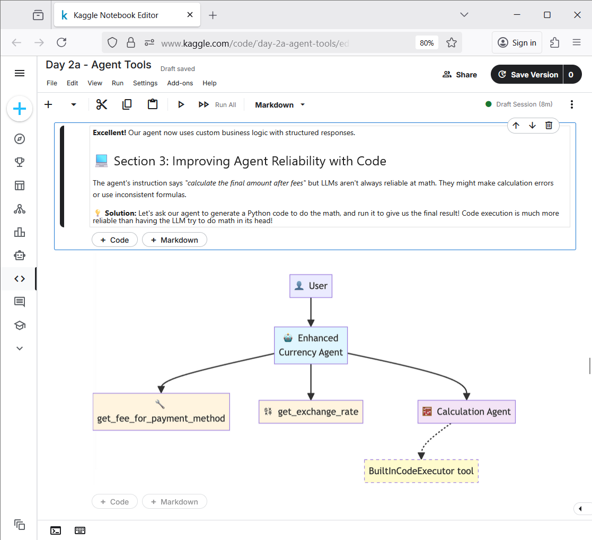
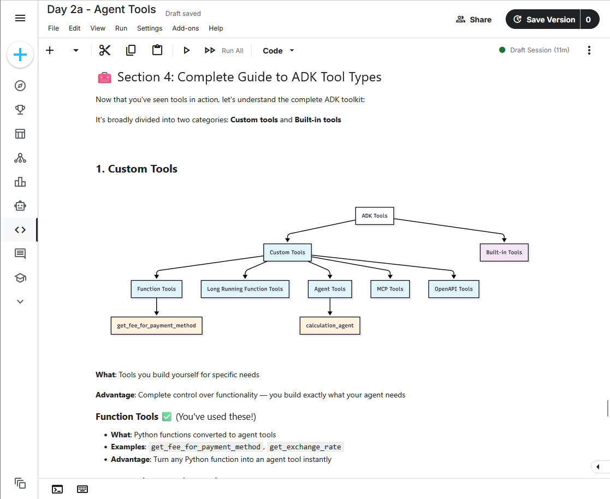
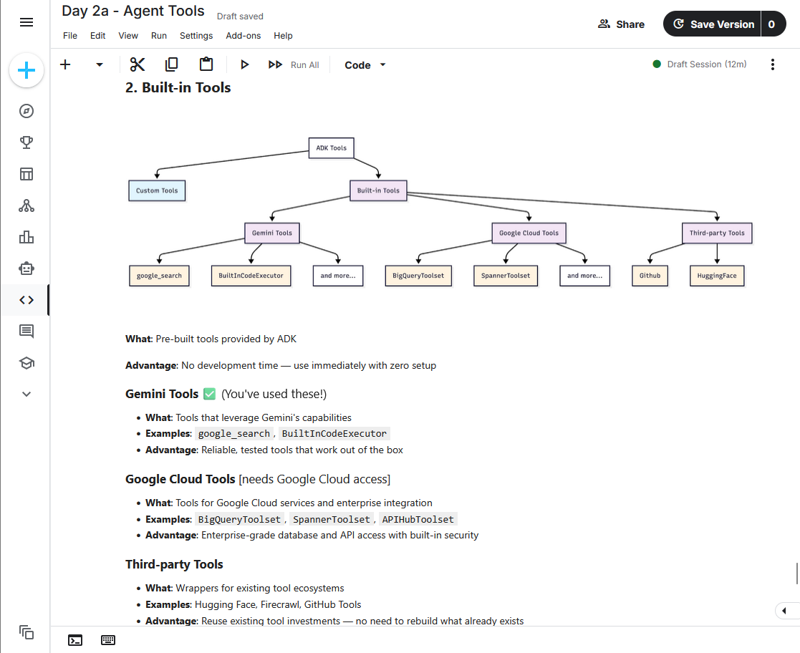
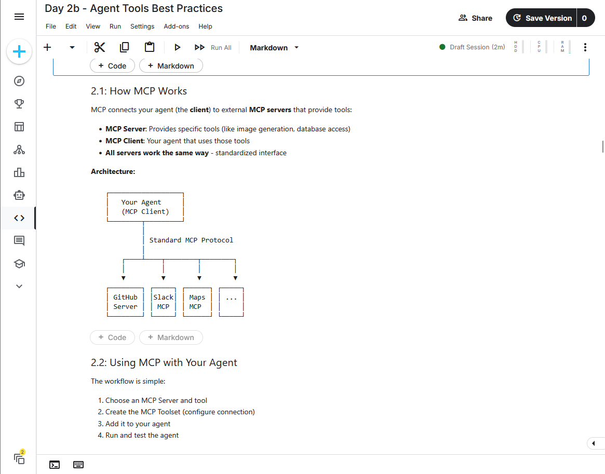
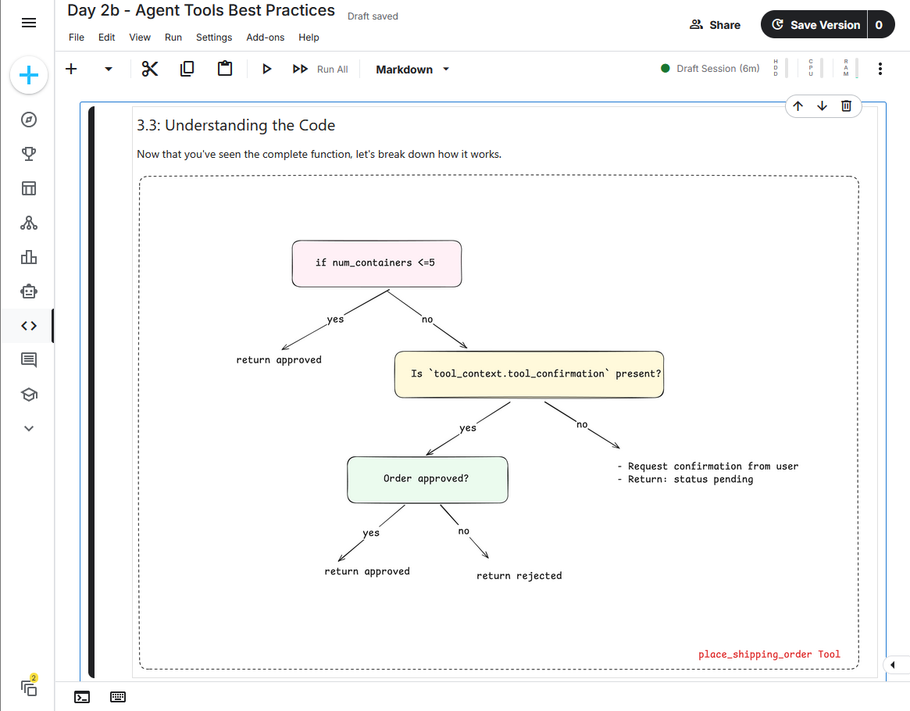
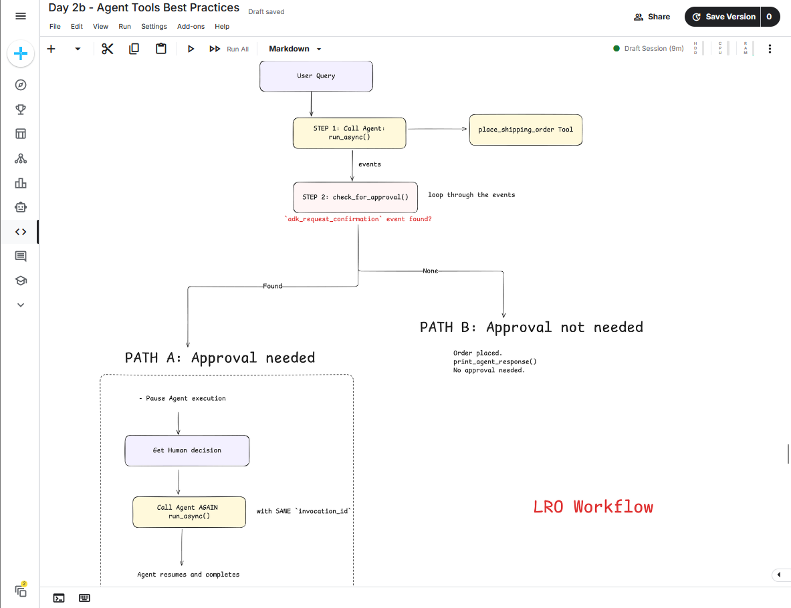
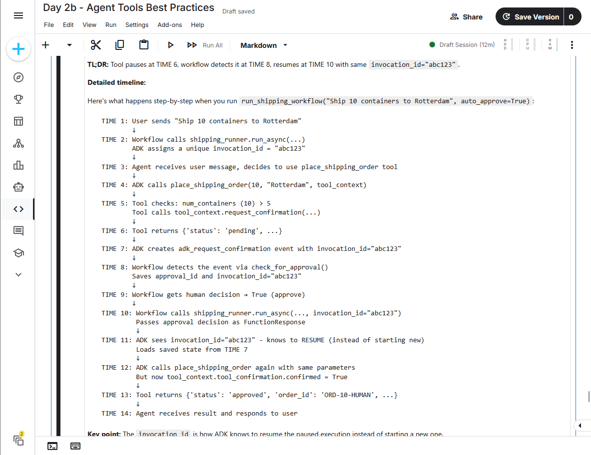
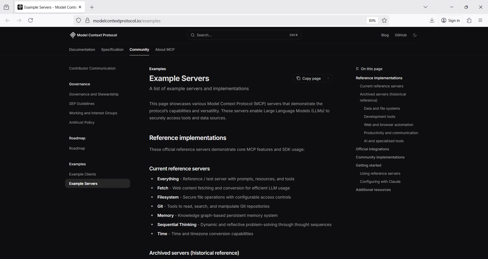
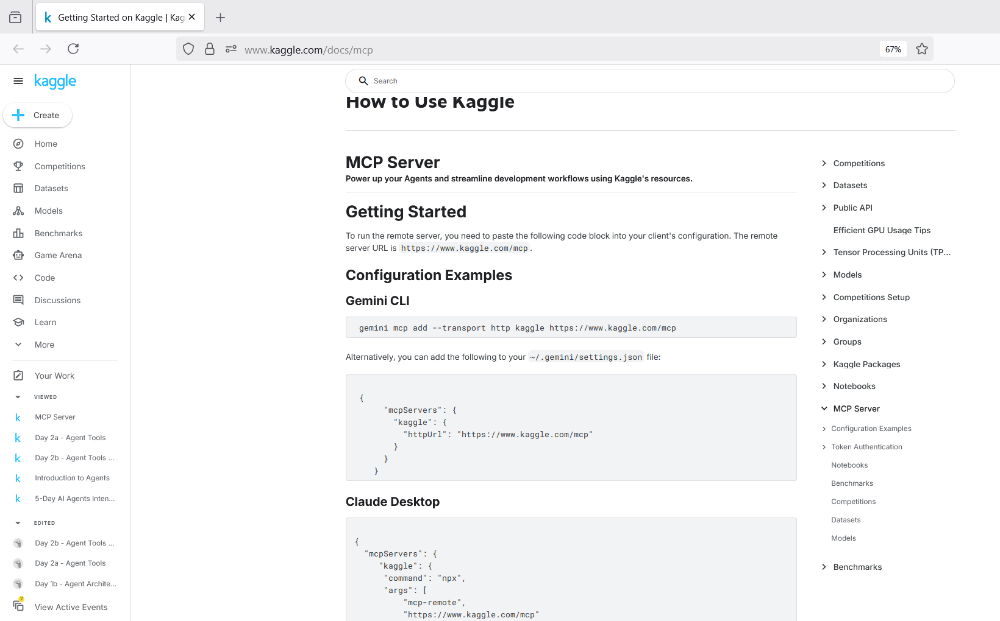
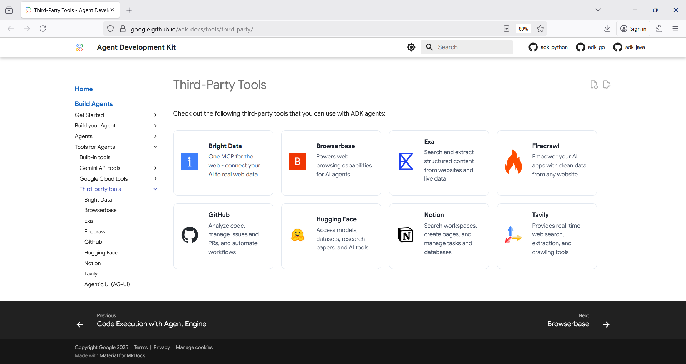

# aiaic_mcptool 🧑‍🏭🧰🏛️
aiaic_mcptool : Agent Tools &amp; MCP # Model Context Protocol # Interoperability # Best Practice # Integration

## Objective
- Leverage external functionalities & APIs
- Using tools offered by Model Context Protocol (MCP)

## AI Agent Tools & MCP

[Agent Tools](./src/2a_tool)

[Best Practice](./src/2b_mcp)
